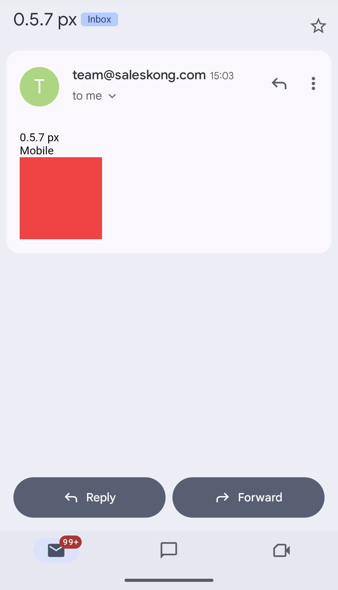
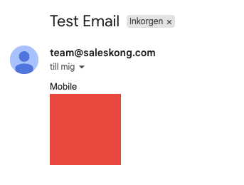
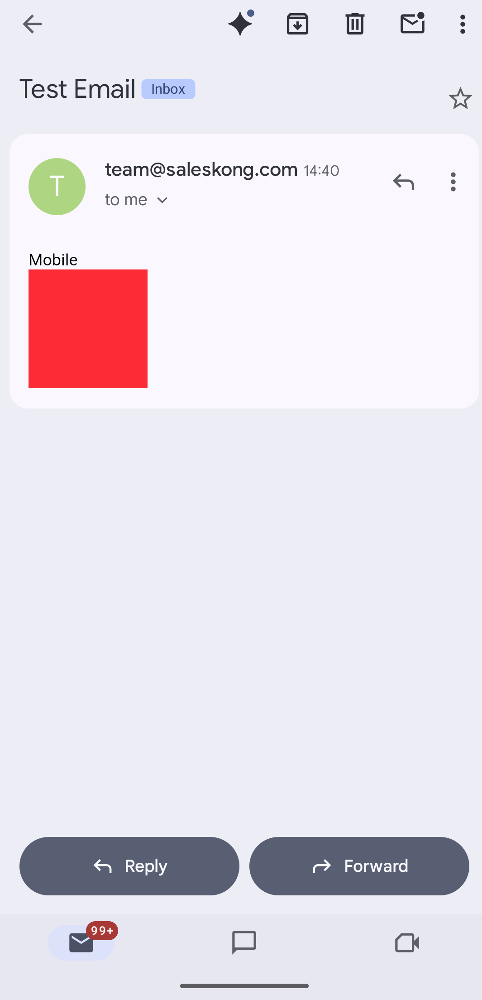
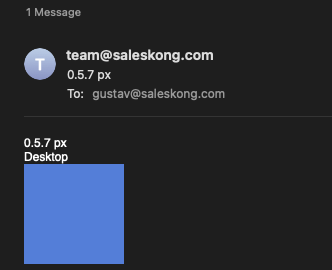
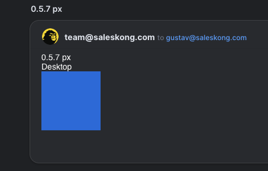
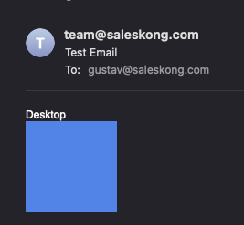
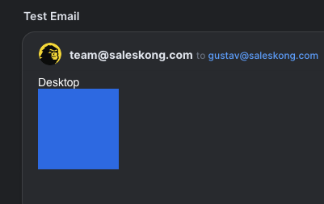

# React Email Gmail Breakpoints Reproduction

This repository demonstrates a regression in `@react-email/components` where media queries break in Gmail desktop between versions 0.5.7 and 1.0.6.

## The Issue

In **version 0.5.7**, media queries are generated correctly and work in Gmail desktop:

```css
@media(min-width:480px){.sm_hidden{display:none !important}}
@media(min-width:480px){.sm_block{display:block !important}}
@media(min-width:480px){.sm_bg-blue-500{background-color:rgb(59,130,246) !important}}
```

In **version 1.0.6**, media queries are nested inside selectors instead of wrapping them:

```css
.sm_block{@media (width>=480px){display:block!important}}
.sm_hidden{@media (width>=480px){display:none!important}}
.sm_bg-blue-500{@media (width>=480px){background-color:rgb(43,127,255)!important}}
```

**Gmail desktop does not support nested media queries** (see [Can I email @media](https://www.caniemail.com/features/css-at-media/)), causing media queries to be ignored and breaking responsive behavior. Other email clients (Apple Mail, Spark) do support nested media queries, so they work correctly.

## Visual Evidence

### Version 0.5.7 - Working ✅

**Gmail Desktop:**


*Media queries work correctly - "Desktop" text is visible and background is blue*

**Gmail Mobile:**



*Mobile view shows "Mobile" text and red background*

### Version 1.0.6 - Broken ❌

**Gmail Desktop:**



*Media queries are ignored - shows mobile view ("Mobile" text and red background) instead of desktop view*

**Gmail Mobile:**



*Mobile view still works correctly*

### Other Email Clients

**Important**: Version 1.0.6's nested media query syntax works correctly in other email clients that support nested media queries, demonstrating that this is a Gmail-specific limitation:

**Apple Mail Desktop (0.5.7):**


**Spark Desktop (0.5.7):**


**Apple Mail Desktop (1.0.6):**


**Spark Desktop (1.0.6):**


## How to Reproduce

I always get to many requests when trying the send email in the playground so created a small send script

1. Create a `.env` file in the root directory with the following variables:

```env
RESEND_API_KEY=your_resend_api_key_here
FROM_EMAIL=your_sender_email@example.com
TO_EMAIL=your_test_email@example.com
```

2. Navigate to the version you want to test:
   - `cd 0.5.7` for version 0.5.7 (working)
   - `cd 1.0.6` for version 1.0.6 (broken)

3. Install dependencies:
   ```bash
   npm install
   ```

4. Send a test email:
   ```bash
   npm run send
   ```

5. Check the email in Gmail desktop - you should see:
   - **0.5.7**: "Desktop" text visible with blue background (correct)
   - **1.0.6**: "Mobile" text visible with red background (incorrect - media queries ignored)

## Generated HTML Comparison

The generated HTML files show the CSS difference:

- [`raw/0.5.7-px-html.txt`](raw/0.5.7-px-html.txt) - Contains CSS media queries that wrap selectors (Gmail-compatible)
- [`raw/1.0.6-px-html.txt`](raw/1.0.6-px-html.txt) - Contains nested media queries (not supported in Gmail)

You can inspect these raw email HTML files to see the exact CSS output differences between the two versions.

## Root Cause

The issue appears to be in how `@react-email/tailwind` generates CSS in version 1.0.6. The media query syntax is reversed - instead of wrapping selectors inside media queries, selectors are wrapping media queries (nested media queries).

**Gmail desktop does not support nested media queries** (see [Can I email @media](https://www.caniemail.com/features/css-at-media/)), causing media queries to fail only in Gmail. Other email clients that support nested media queries (Apple Mail, Spark) work correctly.
